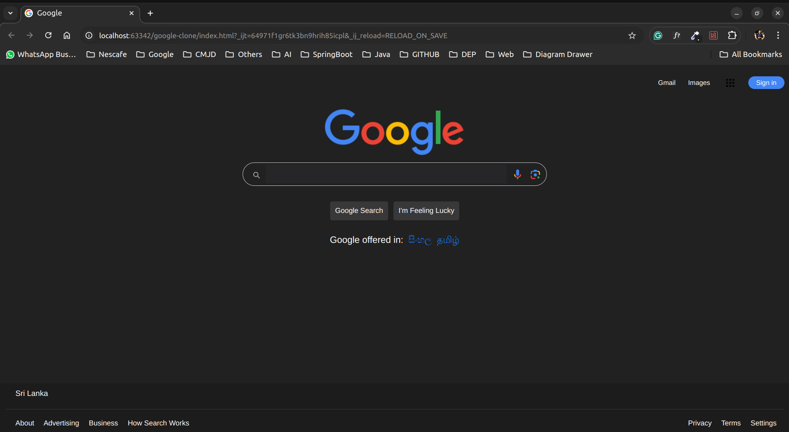
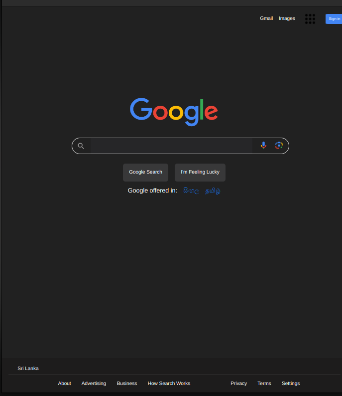
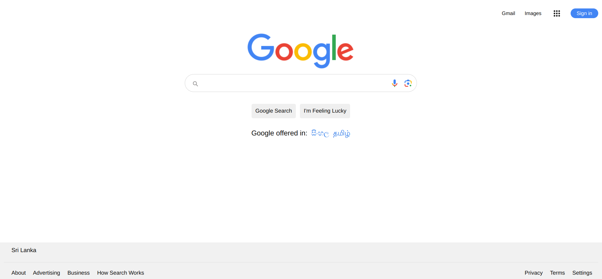

# Google Clone App

A simple Google Clone web application built using modern web technologies. This project aims to replicate the basic functionality and look of Google's search page.

## Table of Contents

- [Project Description](#project-description)
- [Features](#features)
- [Technologies Used](#technologies-used)
- [Getting Started](#getting-started)
- [Usage](#usage)
- [Contributing](#contributing)
- [License](#license)
- [Contact](#contact)
- [Images](#images)

## Project Description

The Google Clone App is a front-end web application that mimics the Google search homepage. It includes a search bar, a logo, and some basic styling. This project is designed to demonstrate the use of HTML, CSS, and JavaScript to build a responsive and functional web page.

This project is a Google clone application designed for educational purposes only.
## Features

- Search bar with basic functionality
- Responsive design for various screen sizes
- Google logo and search button
- Basic styling to match the appearance of Google's homepage

## Technologies Used

- **HTML**: For structuring the web page
- **CSS**: For styling the web page

## Getting Started

### Prerequisites

- A web browser (e.g., Chrome, Firefox, Edge)
- A code editor (e.g., VS Code, Sublime Text)

### Installation

1. Clone the repository:

    ```bash
   https://github.com/UDEEKA/google.lk-clone.git
    ```

2. Navigate to the project directory:

    ```bash
    cd google-clone-app
    ```

3. Open `index.html` in your web browser to view the app.

## Usage

To use the app, simply open `index.html` in a web browser. You can enter text into the search bar, but note that this is a static clone and does not include actual search functionality.

## Contributing

Feel free to contribute to the project by submitting issues or pull requests. Please follow the code of conduct and contribution guidelines when participating.

## License

This project is licensed under the MIT License. See the [LICENSE](LICENSE) file for details.

## Contact

For any questions or feedback, you can reach me at:

- **GitHub**: [UDEEKA](https://github.com/UDEEKA/google.lk-clone.git)
- **Email**: cudeeka@gmail.com

## Images

---

---
